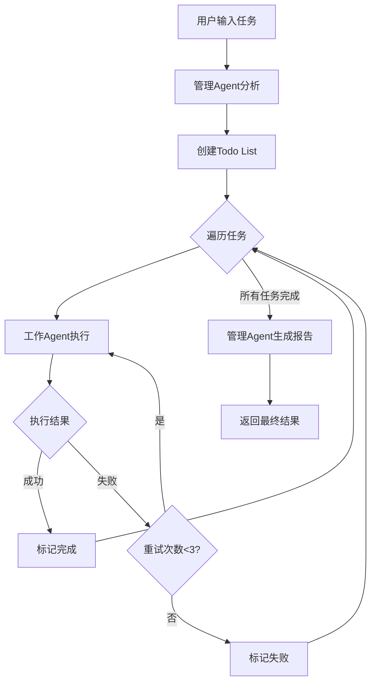

# 🤖 Multi-Agent 任务执行系统

> 基于 [Pydantic AI](https://ai.pydantic.dev/) 框架构建的**多Agent协作系统**，实现了管理Agent与工作Agent的分工协作，支持**百轮级别的工具调用**，让AI真正具备处理复杂任务的能力。

---

## ✨ 核心优势

### 🔄 Multi-Agent 协作架构

采用**双Agent分层设计**，各司其职：

| Agent | 模型 | 职责 |
|-------|------|------|
| **管理Agent** | deepseek-reasoner | 任务规划、拆分、调度、监控、结果汇总 |
| **工作Agent** | deepseek-chat | 工具调用、任务执行、结果反馈 |

```
用户请求 → 管理Agent分析拆分 → Todo List → 工作Agent逐一执行 → 管理Agent汇总报告
```

**优势对比传统单Agent：**

| 特性 | 单Agent | Multi-Agent |
|------|---------|-------------|
| 复杂任务处理 | ❌ 容易迷失方向 | ✅ 有序拆分执行 |
| 上下文管理 | ❌ 容易溢出 | ✅ 按任务隔离 |
| 失败恢复 | ❌ 需要重新开始 | ✅ 仅重试失败部分 |
| 可观测性 | ❌ 黑盒执行 | ✅ 清晰的任务进度 |


### 🛠️ 17项内置工具

工作Agent拥有强大的工具库，覆盖日常开发的各个场景：

<table>
<tr>
<td width="33%">

**📁 文件操作**
- `read_file` - 读取文件
- `write_file` - 创建/覆盖文件
- `edit_file` - 精确编辑
- `append_file` - 追加内容
- `copy_file` - 复制文件
- `rename_file` - 重命名/移动
- `delete_file` - 删除文件
- `get_file_info` - 获取文件信息

</td>
<td width="33%">

**📂 目录操作**
- `list_files` - 列出目录
- `create_directory` - 创建目录
- `delete_directory` - 删除目录

**🔍 搜索功能**
- `search_in_files` - 文件内搜索
- `search_web` - 网络搜索

</td>
<td width="33%">

**🌐 网络操作**
- `fetch_webpage` - 抓取网页
- `http_request` - HTTP请求

**⚙️ 执行操作**
- `run_command` - 执行命令
- `execute_file` - 执行脚本

</td>
</tr>
</table>

---

## 🚀 快速开始

### 1. 安装依赖

```bash
pip install pydantic-ai python-dotenv ddgs requests beautifulsoup4 json-repair
```

### 2. 配置环境变量

创建 `.env` 文件：

```env
BASE_URL=https://api.deepseek.com
API_KEY=your_api_key_here
```

### 3. 运行

```bash
python main.py
```

---

## 📦 项目结构

```
AgentDemo/
├── main.py              # 主程序入口，Multi-Agent调度核心
├── tools.py             # 工作Agent工具集（17个工具函数）
├── ManagementTools.py   # 管理Agent任务管理工具
├── prompt.py            # Agent系统提示词
├── WorkDatabase/        # 工作目录（Agent文件操作的沙箱）
└── README.md
```

---

## 🎯 工作流程



### 执行示例

```
📝 请输入您的任务: 搜索今天的热点新闻，总结成一篇中文报告并保存

============================================================
调度开始……
============================================================
当前步骤: 管理Agent分析任务并创建Todo List...

任务列表 (Todo List)
========================================
⬜ [1] 使用search_web搜索今日热点新闻
⬜ [2] 分析搜索结果，选择5条重要新闻
⬜ [3] 抓取每条新闻的详细内容
⬜ [4] 撰写中文新闻总结报告
⬜ [5] 将报告保存到文件
========================================
进度: 0/5 (0.0%)

========================================
📌 执行任务 [1]: 使用search_web搜索今日热点新闻
========================================
...
✅ 任务 [1] 完成
...
```

---

## ⚙️ 高级配置

### 自定义模型

```python
# 使用不同的模型
result = run_multi_agent_system(
    user_input="你的任务",
    manager_model="deepseek-reasoner",  # 管理Agent使用推理模型
    worker_model="deepseek-chat"         # 工作Agent使用对话模型
)
```

### 调整模型参数

```python
# 在创建Agent时自定义参数
worker_agent = create_working_agent(
    model_name="deepseek-chat",
    parameter={
        "temperature": 0.6,  # 控制创造性
        "top_p": 0.8,        # 核采样
    }
)
```

---

## 🌟 设计理念

1. **分而治之**：复杂任务拆分为简单子任务，各个击破
2. **专注职责**：管理Agent专注规划，工作Agent专注执行
3. **容错机制**：失败不可怕，重试来解决
4. **透明可控**：实时展示进度，用户心中有数
5. **安全沙箱**：文件操作限制在WorkDatabase目录内

