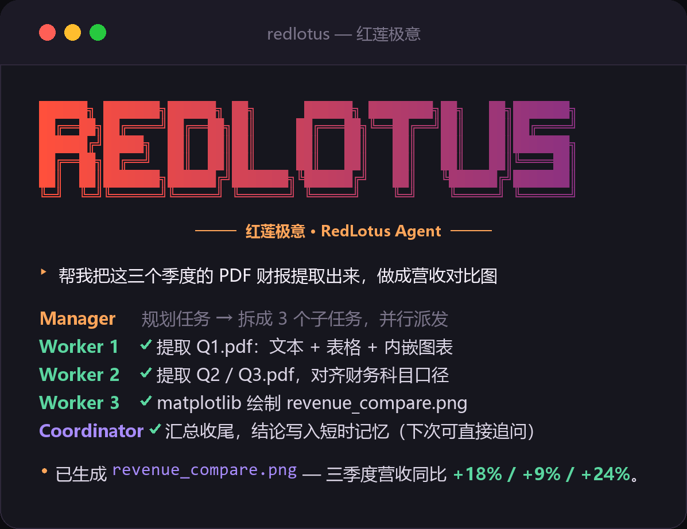
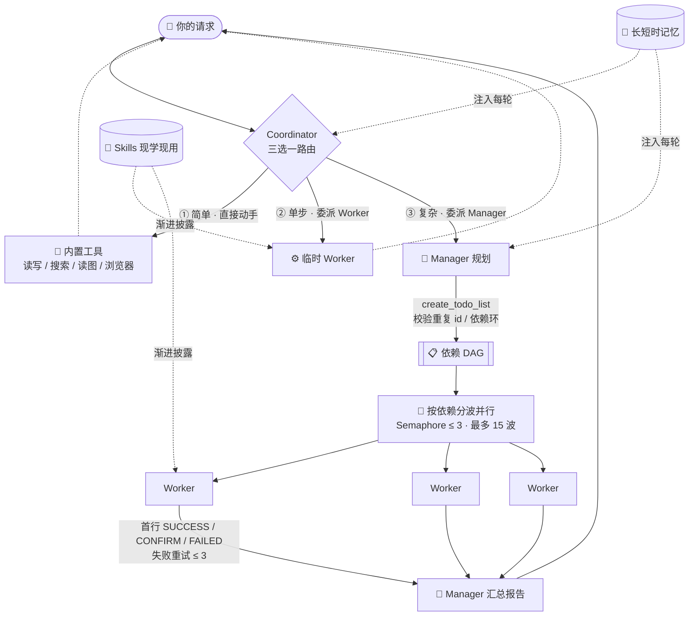
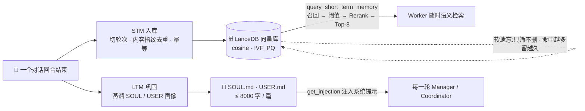

<p align="center">
  
</p>

<p align="center">
  <a href="https://pypi.org/project/redlotus/"></a>
  <a href="https://pypi.org/project/redlotus/"></a>
  
  <a href="https://ai.pydantic.dev/"></a>
  
</p>

<p align="center">
  <em>一个好的 Agent，从来不需要过度设计。<br>
  但它需要记得你说过的话、会叫帮手、还能在 QQ 里回你。</em>
</p>

---

**红莲极意（RedLotus）** 是一朵会自己长技能的 AI Agent，活在你的终端里：

- 复杂的事丢给 **Manager** 拆解、**Worker** 并行去干，乱局交给 **Coordinator** 收拾；
- 聊过的写进**短时记忆**可随时语义召回，重要的烙进**长期记忆**跨会话不忘；
- 内置文件提取能把 PDF 拆成**文本 + 表格 + 图片 + 页面结构**，而不是干巴巴一段纯文本；
- 量化回测、技术指标、文生图、爬网页等领域能力，靠**技能（Skills）现学现用**——甚至运行时 `clawhub` 一行装新技能、当回合即生效，而不是堆一层又一层的框架。

```bash
pip install redlotus && redlotus
```

<p align="center">
  
</p>

---

## ✨ 为什么是红莲

|  | 能力 | 说到底是什么 |
|:--:|------|------|
| 🧭 | **三角色自治编排** | Coordinator 对每条输入「直接动手 / 派一个 Worker / 交给 Manager 规划」三选一；Manager 拆出带依赖的任务 DAG，多 Worker 按依赖**分波并行**，失败自动重试，不可逆操作**人在回路**确认 |
| 🔁 | **goal 自治模式** | 给一个目标，它自己一轮轮干到完成——靠隐藏哨兵自评 `DONE / CONTINUE`，干活途中你还能随时插话，下一轮自动并入 |
| 🧠 | **三层记忆，不失忆** | 每轮对话自动入向量库可语义召回（内容指纹去重、软遗忘只筛不删）；对话蒸馏成 SOUL / USER 长期画像注入每一轮——换工作目录也不丢 |
| 🧩 | **技能即插即用 + 现学现用** | 系统提示只放「名称 + 一句话」，完整指令/资料/脚本**渐进式按需加载**；`npx clawhub` 运行时装新技能、每回合热重载，装完即用免重启 |
| 📄 | **结构化文件提取** | PDF 逐页拆成 Markdown：元数据 + 正文 + 还原的表格 + 导出的内嵌图 + 链接；纯图页诚实标注「未做 OCR」而非假装能读 |
| 🖥️ | **终端原生体验** | 默认全屏 TUI，模型回复实时流式预览、上下文用量条、实时面板；Agent 每次写盘可**逐块 diff 审查**（`Ctrl+R`，逐 hunk `y/n`） |
| 🔌 | **接任意 OpenAI 兼容模型** | 填个 `BASE_URL` + `API_KEY` 就能换模型；四个角色各自配模，在线探测上下文窗口与价格，`/usage` 出真实美元账单 |
| 🛡️ | **工程化护栏** | 路径沙箱、危险命令黑名单、子进程**进程树回收**、QQ 媒体下载 **SSRF 加固**、上下文压缩做成「可恢复检查点」 |
| 🤖 | **能出门** | 终端是主场，QQ（NapCat / OneBot）与微信机器人是副线，复用同一个 Agent 内核 |

> 底层：[Pydantic AI](https://ai.pydantic.dev/) · LanceDB 向量库 · Playwright · 你配置的任意 OpenAI 兼容 API。默认装配 `deepseek-v4-pro`（规划/协调）与 `deepseek-v4-flash`（执行），一条命令即可换成任何你想用的模型。

---

## 🏗️ 它怎么运作

每条输入先到 **Coordinator** 手里，由它判断该多大力气去办——能自己解决就别惊动别人，复杂的才升级到 Manager 做多步规划。


```mermaid
flowchart TB
    U(["🧑 你的请求"]) --> CO{"Coordinator<br/>三选一路由"}
    CO -->|"① 简单 · 直接动手"| TOOLS["🧰 内置工具<br/>读写 / 搜索 / 读图 / 浏览器"]
    CO -->|"② 单步 · 委派 Worker"| ADHOC["⚙️ 临时 Worker"]
    CO -->|"③ 复杂 · 委派 Manager"| MGR["🧭 Manager 规划"]
    MGR -->|"create_todo_list<br/>校验重复 id / 依赖环"| DAG[["📋 依赖 DAG"]]
    DAG --> WAVE["🌊 按依赖分波并行<br/>Semaphore ≤ 3 · 最多 15 波"]
    WAVE --> W1["Worker"]
    WAVE --> W2["Worker"]
    WAVE --> W3["Worker"]
    W1 -->|"首行 SUCCESS / CONFIRM / FAILED<br/>失败重试 ≤ 3"| SUM["📝 Manager 汇总报告"]
    W2 --> SUM
    W3 --> SUM
    SUM --> U
    TOOLS -.-> U
    ADHOC -.-> U
    MEM[("🧠 长短时记忆")] -. 注入每轮 .-> CO
    MEM -. 注入每轮 .-> MGR
    SK[("🧩 Skills 现学现用")] -. 渐进披露 .-> ADHOC
    SK -. 渐进披露 .-> W1
```

- **三选一路由**：不确定时优先升级（直接 < Worker < Manager），既不大材小用，也不小马拉大车。
- **真正的依赖 DAG**：`create_todo_list` 会校验重复 id、未知依赖，并用 DFS 检测依赖环；只有依赖全部完成的任务才进入当前「波」。
- **协议化的 Worker**：默认「Code First」写完整脚本而非堆叠一次性工具调用，输出首行以 `SUCCESS: / CONFIRM: / FAILED:` 开头被编排器机器解析；上游结果回灌下游提示。
- **角色按成本分工**：规划/协调用更强的模型，批量执行用更快的模型，把贵算力花在判断上。

---

## 🧠 记忆系统

记忆分三层，让「不失忆」落到实处——而不是每次开机都重新认识你。


```mermaid
flowchart LR
    H["💬 一个对话回合结束"] --> S["STM 入库<br/>切轮次 · 内容指纹去重 · 幂等"]
    H --> L["LTM 巩固<br/>蒸馏 SOUL / USER 画像"]
    S --> DB[("🗄️ LanceDB 向量库<br/>cosine · IVF_PQ")]
    L --> P["📜 SOUL.md · USER.md<br/>≤ 8000 字 / 篇"]
    DB -->|"query_short_term_memory<br/>召回 → 阈值 → Rerank → Top-8"| WK["Worker 随时语义检索"]
    P -->|"get_injection 注入系统提示"| AG["每一轮 Manager / Coordinator"]
    DB -. "软遗忘:只筛不删 · 命中越多留越久" .-> DB
```

- **短时记忆（STM）**：每个完整对话轮次自动嵌入写入 LanceDB；即便内容已被上下文压缩裁掉，向量行仍**只增不删**，Worker 用 `query_short_term_memory` 随时语义召回。去重靠内容指纹（NFKC 归一化 + 空白折叠的 SHA1），崩溃重放、重连都不会产生重复。
- **软遗忘**：只过滤召回结果、绝不删行——有效 TTL 随命中次数对数增长（越常用记越久），从未检索过的行永久豁免。遗忘极度保守、且可逆。
- **长期记忆（LTM）**：把对话蒸馏成 SOUL（环境/助手习惯）与 USER（用户其人/偏好）两份整篇 Markdown 画像，每轮注入系统提示，无需检索就跨会话保留人格与偏好。巩固有频率门控 + 长度比/相似度防漂移 + 「除非明确反转否则绝不因没复述而删」的 supersession-only 规则。
- **检索管线**：向量召回 → 相似度阈值过滤 → Reranker 精排到 Top-8（`Qwen3-Embedding-0.6B` + `Qwen3-Reranker-0.6B`）。
- **落点**：记忆与向量库落在**全局用户数据目录**，跟随你跨所有工作区；源对话日志按工作区（`.redlotus/`）隔离。

---

## 🧩 技能：现学现用

技能以 `SKILL.md` 描述，系统提示里只注入「名称 + 一句话」，完整指令、参考资料、脚本三层**按需逐级加载**（渐进式披露），技能再多也不撑爆上下文。脚本在技能目录内沙箱执行，只把输出喂回上下文。

随包内置 **12 个**技能，开箱即用；运行时还能 `npx clawhub --dir skills install <slug>` 现装现用，每个用户回合自动热重载。

| 技能 | 能干什么 |
|------|------|
| `crypto-backtest` | 加密货币量化回测：内置 EMA / RSI / MACD / 布林策略，经 ccxt 多交易所取 OHLCV，参数扫描，输出胜率 / 盈亏比 / PnL / 最大回撤 |
| `talib-technical-analysis` | 150+ TA-Lib 技术指标，内置语义锁与反模式，支持 A 股 / 港股 / 加密 |
| `bfl-api` · `flux-best-practices` | Black Forest Labs **FLUX 文生图** API 集成 + 提示词规范 |
| `agent-browser` | 无头浏览器自动化：无障碍树快照 + `@ref` 选元素、会话隔离、网络拦截、截图 / PDF |
| `agentic-coding` | 契约式编程协议（PACT 循环：问题界定 → 验收设计 → 变更集 → 红绿验证 + 交付包） |
| `ci-cd` · `web-scraping` | 跨 web / mobile / backend 的 CI/CD 自动化；静态 + 动态网页抓取 |
| `manage-skills` · `skill-creator-operator` · `skill-vetter` | 技能治理三件套：装 / 更 / 删、创作脚手架、**先审后装**的安全审核 |

---

## 🚀 快速开始

**Python 3.12+** · Windows / Linux / macOS 均可。最直接——装上就能用：

```bash
pip install redlotus
redlotus
```

> `redlotus` 命令会装进当前 Python 的 `Scripts`（Win）/ `bin`（Linux·mac）目录。只要该目录在 PATH 上（python.org、conda 默认都在），**之后随便开个终端敲 `redlotus` 就启动**。

想要一个**独立隔离、不污染你 Python 环境**的全局命令（推荐纯命令行使用）：

```bash
uv tool install redlotus      # 或者：pipx install redlotus
redlotus
```

这会单独建一个隔离环境，并把 `redlotus` 挂到全局 PATH——任意新终端直接启动，且与你别的项目互不干扰。

**可选能力（extras，按需装）：**

```bash
pip install "redlotus[browser]"   # 浏览器 Skill（装后再 playwright install chromium）
pip install "redlotus[bots]"      # QQ / 微信 机器人
pip install "redlotus[viz]"       # 绘图 / PDF 生成 / 图像（量化回测等技能用）
pip install "redlotus[all]"       # 一次装全
```
> extras 同样适用于 `uv tool install "redlotus[browser]"` 这种写法。

### 配置与数据落点

首次运行会在**用户配置目录**生成 `config.json`（Windows：`%LOCALAPPDATA%\RedLotus`；Linux：`~/.config/RedLotus`；macOS：`~/Library/Application Support/RedLotus`）。在其中填好 `BASE_URL`、`API_KEY`、`RAG_models` 与各角色模型；也可用**环境变量**或就近的 `.env` 覆盖同名项（优先级：环境变量 → `.env` → `config.json`）。

- **跟随用户（全局）**：日志、向量库（RAG）、长期记忆，落在用户数据目录，换工作目录也不丢。
- **跟随工作目录**：Agent 工作产物 `WorkDatabase/` 与会话快照 `.redlotus/`，落在你**启动时的当前目录**，可用 `/load`、`/cd` 随时回载历史对话。

---

## 💬 让它在群里说话（可选）

```bash
pip install "redlotus[bots]"
python -m redlotus.API.QQ       # 需配置 QQBOT 等环境变量
python -m redlotus.API.WeChat   # 扫码登录
```

QQ 机器人前置：先装好并运行 [NapCat](https://github.com/NapNeko/NapCatQQ)（提供 OneBot WebSocket 接口）。首次会在用户配置目录从随包模板生成 `config.yaml`，在其中填好 `bt_uin`（机器人 QQ 号，也可用环境变量 `QQBOT_ID` 覆盖）与 `napcat.webui_token`（需为强密码：至少 12 位且含数字、大小写字母与特殊符号）。配置缺失或无效时启动会直接报错退出，不会静默卡住。

> 机器人侧已工程化处理：每会话独立队列、连发消息自动合并、超长回复按段切分、空闲会话回收，以及把 Agent 的「向你提问」转成一条聊天消息等你回答。

---

## ⌨️ 终端速查

默认进全屏 TUI，几个高频操作：

| 键位 | 作用 |
|------|------|
| `Shift+Tab` | 在 **审查 → 放行 → 目标** 三种运行模式间循环 |
| `Ctrl+R` | 进入逐块改动审查：`y` 保留 / `n` 撤销 / `↑↓` 切换 / `Esc` 退出 |
| `@路径` | 引用文本文件（支持 `@{path}`、`@"path"`，Tab 补全） |
| `Ctrl+C` / `Ctrl+Q` | 停止当前回合 / 退出 |

<details>
<summary><b>斜杠命令一览（点击展开）</b></summary>

| 命令 | 说明 |
|------|------|
| `/help` | 显示帮助 |
| `/clear`（或「新任务」） | 清空上下文并开启新对话（旧快照保留在 `.redlotus`） |
| `/exit` `/quit` | 退出 |
| `/pwd` · `/cd <path>` | 查看 / 切换工作目录（切换时自动加载该工作区对话） |
| `/load` | 从当前工作区选择并回载对话快照 |
| `/config` · `/context` · `/panel` | 配置摘要 · 上下文 token 用量 · 工作区运行总览 |
| `/usage [path]` | 按真实 usage 统计 token 与**美元成本** |
| `/skills` | 查看已加载 Skills |
| `/LTM show｜clear` · `/STM show｜clear` | 查看 / 清空长期 · 短期记忆 |
| `/agent [<role> <模型名>]` | 查看或切换某角色模型 |
| `/effort [<role> <off｜minimal｜low｜medium｜high｜xhigh｜max>]` | 调各角色思考力度 |
| `/api` | 修改 `BASE_URL` 与 `API_KEY` |
| `/compress` | 压缩 Manager / Coordinator 上下文 |
| `/status` · `/trace <turn_id>` · `/tasks` | 生命周期 · 回合追踪 · 任务状态 |
| `/stop` · `/cancel <id>` | 中断当前回合 · 取消某个 invocation |

</details>

---

## 🔧 给折腾的人

```bash
git clone <repo> && cd Agent
pip install -e ".[dev]"         # 开发安装（仓库根；之后 redlotus 命令直连源码）
python main.py                  # 等价于 redlotus，便于断点调试
pytest tests/ -q                # 冒烟
pip install ".[build]" && pyinstaller build.spec   # 打成可执行目录（可选）
```

代码在 `src/redlotus/`，命令入口 `redlotus`（= `redlotus.agent_core.entrypoint:main`）。随包默认配置 `src/redlotus/config.json` 仅作首次 seed 用，运行时实际读写**用户配置目录**里的 `config.json`。设环境变量 `REDLOTUS_LEGACY_CLI=1` 可从默认 TUI 切回传统 prompt_toolkit REPL。

**自己发版**（构建 + 上传 PyPI，token 形式）：

```bash
uv build                                    # 产出 dist/*.whl 与 *.tar.gz
uv publish --token pypi-<你的-pypi-token>   # 或先设 UV_PUBLISH_TOKEN 再 uv publish
```

---

<p align="center">
  <em>启动后你会看到那行字：</em><br>
  <b>❦ ────  红莲极意  ·  RedLotus Agent  ──── ❦</b>
</p>
